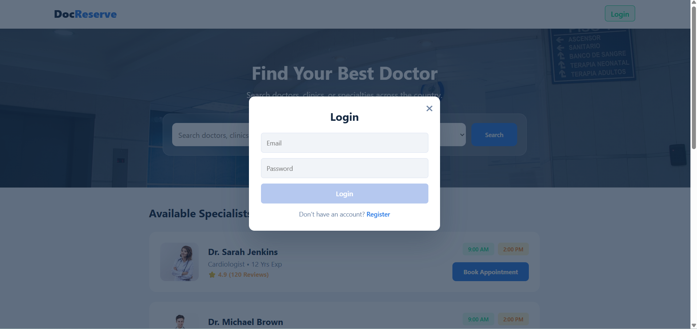
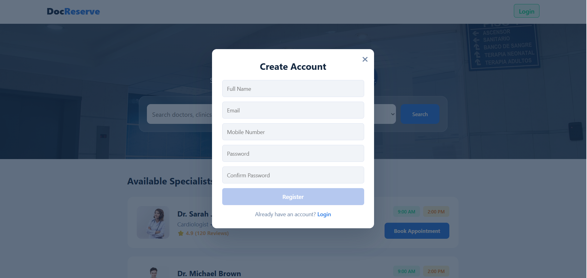
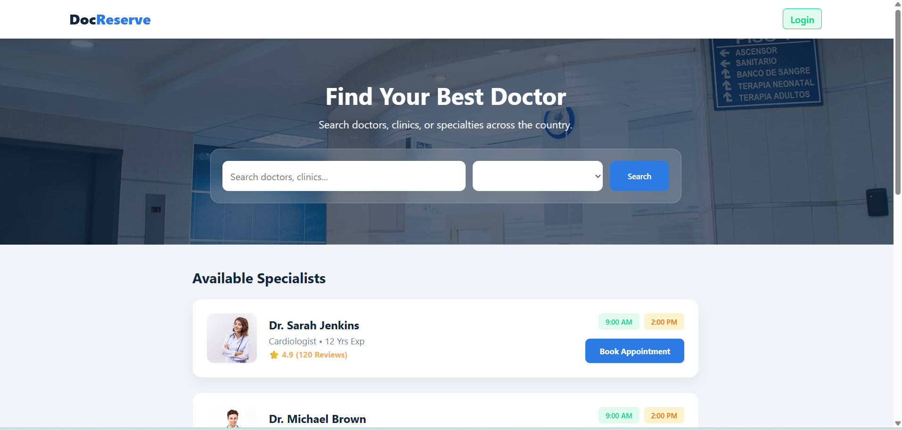
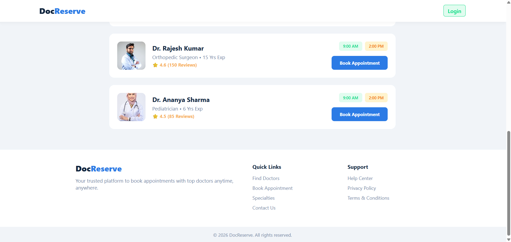
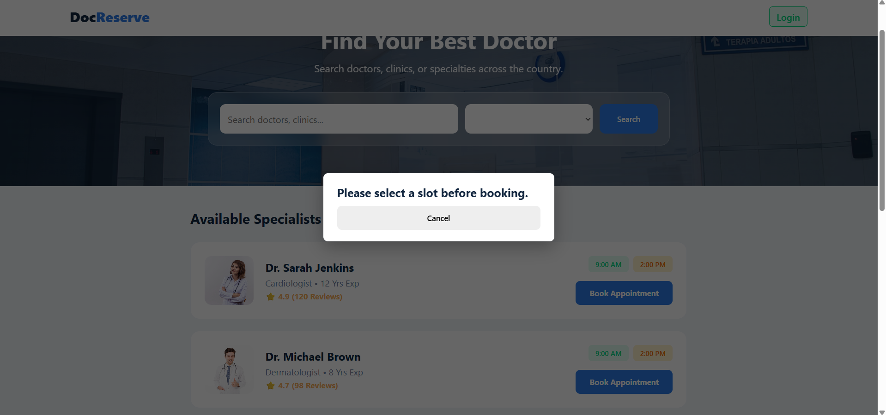
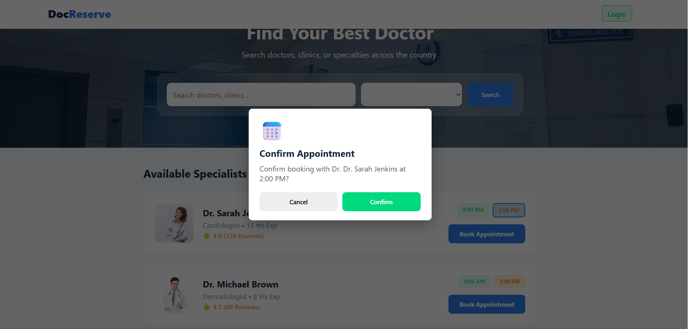
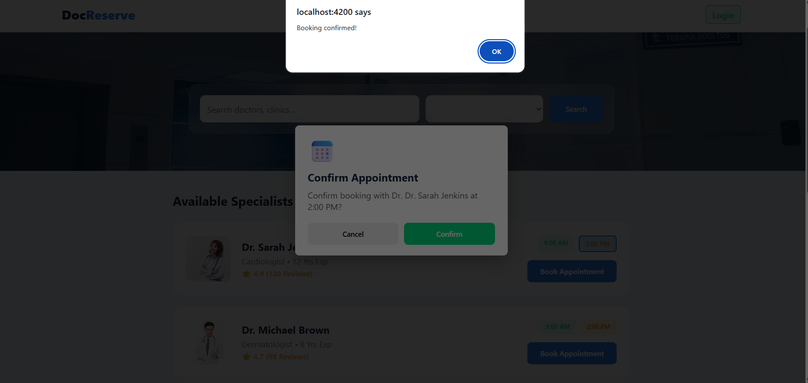

Application: Frontend Doctors Appointment
Description:

Frontend Doctors Appointment is a user-friendly web application that allows users to search for doctors, view their profiles, check available time slots, and book appointments seamlessly. The application provides an intuitive interface for patients to select preferred doctors and appointment slots, while ensuring a smooth booking experience with proper validations and feedback. The system focuses on usability, responsiveness, and real-time interaction to improve the overall patient experience.

Technology:

Built with Angular, HTML, CSS, TypeScript, and Bootstrap to deliver a responsive, scalable, and dynamic user interface.








# FrontendDoctorsAppointment

This project was generated using [Angular CLI](https://github.com/angular/angular-cli) version 20.3.11.

## Development server

To start a local development server, run:

```bash
ng serve
```

Once the server is running, open your browser and navigate to `http://localhost:4200/`. The application will automatically reload whenever you modify any of the source files.

## Code scaffolding

Angular CLI includes powerful code scaffolding tools. To generate a new component, run:

```bash
ng generate component component-name
```

For a complete list of available schematics (such as `components`, `directives`, or `pipes`), run:

```bash
ng generate --help
```

## Building

To build the project run:

```bash
ng build
```

This will compile your project and store the build artifacts in the `dist/` directory. By default, the production build optimizes your application for performance and speed.

## Running unit tests

To execute unit tests with the [Karma](https://karma-runner.github.io) test runner, use the following command:

```bash
ng test
```

## Running end-to-end tests

For end-to-end (e2e) testing, run:

```bash
ng e2e
```

Angular CLI does not come with an end-to-end testing framework by default. You can choose one that suits your needs.

## Additional Resources

For more information on using the Angular CLI, including detailed command references, visit the [Angular CLI Overview and Command Reference](https://angular.dev/tools/cli) page.
